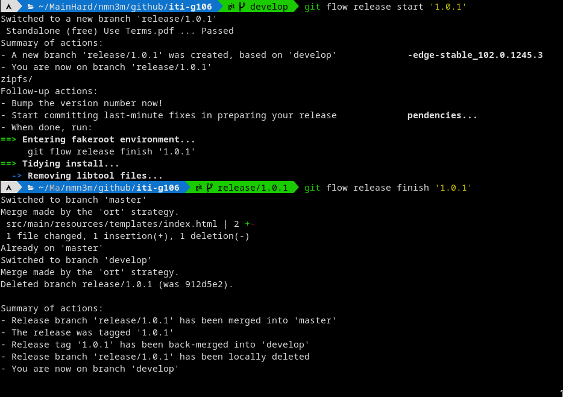
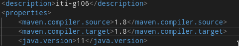
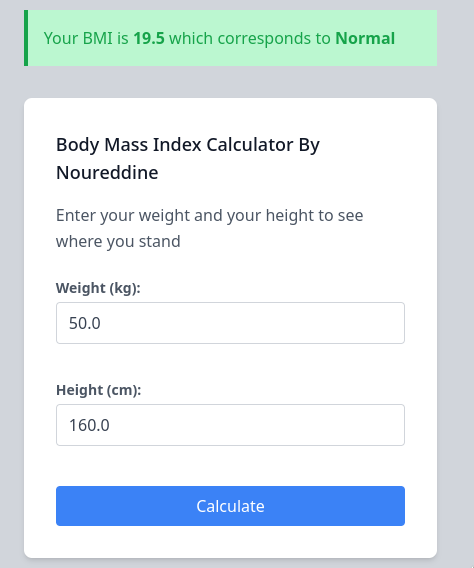
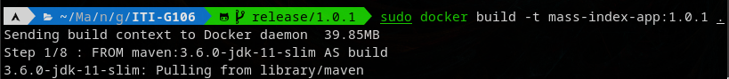
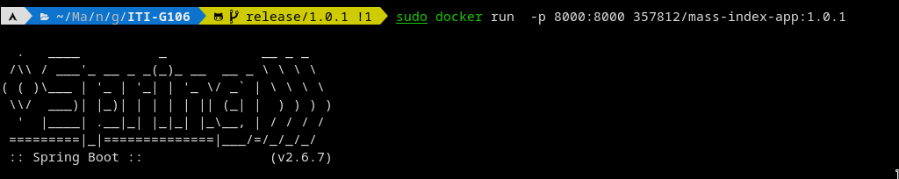
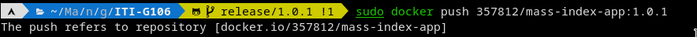
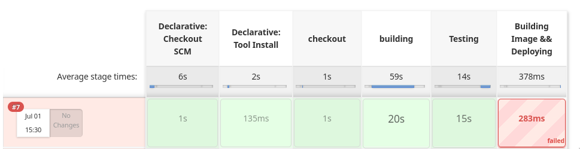

# Body Mass Index Calculator

This is a Web application to calculate you body mass index built with Spring Boot

## Prerequisites
* JDK 8+
* Apache Maven 3.5+
---
## How i do task1?
- 

### How i build this web app?
- i use [maven](https://maven.apache.org/).
	### Note
	- i face some issue that i have many version of java so i edit pom.xml
	
- mvn clean 
- mvn compile 
- mvn package 
- Then, I run .jar by using java
		java -jar ./target/iti-g106-1.0.1.jar
- work on port localhost:8000

- 
---
## How i do task2?
- i wrote docker file.
- i built it and run it.
 
 
###### now i have image in my local device and sometimes i will return to use it again so the best choice to make it public on **Docker Hub**
- make account, make repos and push your images.
 
- now it's available here [image](https://hub.docker.com/r/357812/mass-index-app/tags)
--- 
## Dealing with jenkins 
- failure 

